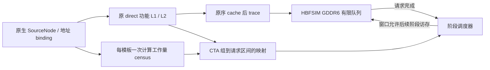

# Direct trace 回放档：纯访存、阶段重叠、多后端

本页合并原先三份 replay 档说明，三者在同一条 direct trace 路径上由浅到深：

| 档位 | 入口 | 跳过什么 | 保留什么 |
|---|---|---|---|
| 纯访存 | `replay.py` | 计算、依赖、GPU stall | 内存队列与时序 |
| 阶段重叠 | `replay.py --mode stage-overlap` | warp/DAG 调度 | 阶段计算 + 访存重叠，跨 kernel 屏障 |
| 多后端 | `replay.py --mode stage-overlap --backend ...` | 同上 | GDDR6 / HBM / HBF 可分别配置 |

正文按原样保留在下面各节。

## 共用口径

- 三档的地址流相同；**过 cache 流量不保证逐条相同**，跳过计算与在途请求会改变跨
  warp/CTA 顺序、MSHR 合并与 LRU。需要实际调度顺序的地址流时用 `cosim --trace`。
- 各档报告的 CPU/wall 时间是宿主耗时，与保留计算依赖的 cosim 口径不同，不能并列
  比较。
- HBF 的请求字节、4 KB 页介质流量、控制器 HBM 流量与最终持久化尾部是**四个独立
  计数**，不能混为同一个带宽。
- 硬件时序尚未校准；后端与阶段模型**没有**使用 NCU 流量或带宽拟合系数。

<!-- 以下正文合并自：replay-modes.md replay-modes.md replay-modes.md -->

## Direct trace → HBFSIM 纯访存回放


已在独立融合分支 `codex/tilegen-trace-cosim-20260918-r1` 增加 `replay.py` 和独立 `tilegen_replay` 可执行程序。使用已有 `direct` 模式生成的 cache 后 trace，不创建 Model、解压模板、重建访存指令、重复执行 cache 或调度计算 DAG。B8 仍暂停。

```text
原生访存规则 → 功能 L1/L2 → dram.tgn → 有限队列 → HBFSIM → 完成 / 流量 / 带宽
                direct              memory-only replay
```

### 计算与等待的范围

| 项目 | 本次回放 |
|---|---|
| 地址、顺序、读写方向、请求宽度 | 逐条保留 direct trace；读 128 B，写 32 B |
| 计算指令、warp 依赖、GPU stall、计算/访存 overlap | 不执行 |
| L1/L2、MSHR、dirty flush | 不再次执行；只消费已在文件里的 cache 后请求 |
| 请求到达 | trace 无原始时间戳；全部在模拟 t=0 就绪，按文件顺序尽快准入 |
| 背压与内存时序 | 保留有限 credits、bank/row 冲突、读写切换和 DRAM 命令等待 |
| 跨 kernel | 连续回放，不设 kernel barrier，不重置行状态 |
| 最后排空 | 文件读完后等待所有已提交请求完成；无额外 cache flush |

“去掉 stall”指去掉 GPU 的依赖与调度停顿。HBFSIM 自身的内存服务等待必须保留，才能得到有意义的服务时间和带宽。默认沿用原 global service，每次推进一个时钟；仅当所有已准入请求都已有确定完成时间时跳到下一完成事件。

每个 channel 最多 32 个 32 B burst credits；128 B 读占 4 个，32 B 写占 1 个；全局最多 4096 个未完成 parent。当前 trace 项受阻时，后面的请求不能绕过它。注入顺序及 credits 会影响带宽，因此结果不是硬件峰值，也不自动构成完整推理耗时的严格下界。

### 本机验证结果

以下是单次 CPU 测量，包含 trace 读取、SHA/格式校验及 HBFSIM drain；编译、原 trace 生成另计。MB/GB 使用十进制。输入来自已有 Llama3-8B BF16 / B1 / P32-D2 工作流的**有界子集**。

| 样本 | 条目 | DRAM 读 MB | DRAM 写 MB | 回放 CPU 分钟 | 回放 elapsed 分钟 | 模拟内存时间 μs | 总带宽 GB/s |
|---|---:|---:|---:|---:|---:|---:|---:|
| 20 families，各 1 CTA；global | 68,258 | 8.74 | 0.00 | 0.00595 | 0.01926 | 61.10 | 142.99 |
| Decode2 的 GEMV / SiLU / GEMV，共 1025 CTA；global | 591,652 | 75.60 | 0.03 | 0.02161 | 0.02195 | 225.05 | 336.05 |
| 同一 Decode trace；independent | 591,652 | 75.60 | 0.03 | 0.01781 | 0.01825 | 225.05 | 336.05 |

Decode 写字节为 **33,920 B**，读字节为 **75,595,776 B**；该样本不是完整单次 decode token，更不是完整 P32/D2。global 与 independent 的完整物理统计、完成周期、逐 call 统计、请求形状 hash 精确一致。本次默认保持 global，不把一次 CPU 差别推广为稳定加速比。

带宽计算：`(读字节 + 写字节) / (最后物理完成 ns − 首次准入 ns)`，单位 GB/s。Decode global 读、写分别为 **335.90 / 0.15 GB/s**，使用同一个总时间分母。逐 call 的首尾时刻只是合成内存注入/完成窗口，窗口可能重叠，不能称为 kernel 执行时间。

已有 Decode direct 生成 CPU **25.10 s（0.41837 min）**；此次 global 回放 **1.30 s（0.02161 min）**；跨两次测量相加约 **26.40 s（0.43998 min）**。此前完整精确 cosim 相同选中子集的 CPU 中位数为 **45.97 s（0.76613 min）**，两者精度口径不同，不能声称是等价 cosimulation 加速。同一 trace 可反复回放而无需再次支付 25.10 s 的前处理/生成成本。

### 流量与精度边界

HBFSIM 回放不会重新计算 cache 命中，也不会根据带宽或 NCU 修改 trace 字节。请求数、方向、地址、宽度和顺序形状 hash 均闭合，所有已准入请求最终完成、credits 归零。

此前精确 cosim 对同一选中子集的写流量是 4,864 B，而 direct 为 33,920 B。差别已经在两者不同的 cache 访问顺序与在途合并中产生；本次回放保留 direct 的 33,920 B，不会把它拟合成精确 cosim 或 NCU 的值。`source_final_dirty_flush=false`；文件中没有的 resident dirty sector 不会在 EOF 凭空添加。

当前 GDDR6 意图配置仍是既有未做硬件时序校准的通用 banked 模型，地址是 packed service 地址，不是已恢复的 GPU 物理 channel/bank 映射。本次未做 GPU 采样、NCU 拟合或完整 1138-call 重跑。原 direct 收据只封存配置路径；新回放额外保存当前配置文件副本、SHA 和解析后的完整内存身份，不能倒推证明历史配置字节未变。

### 运行方法

在仓库根目录执行，输出路径须尚不存在：

```sh
python3 build.py --replay --output build/replay-r2 --native --thin-lto
python3 replay.py \
  --source-run build/shared-frontend-validation/decode-direct \
  --input ../validation-inputs/decode-512.input \
  --output build/my-decode-replay
```

已构建的二进制可直接用于第二条命令；也可用 `--binary /absolute/path/tilegen_replay` 指定新构建。`--drain independent` 为可选原生服务实现；默认 `global`。wrapper 默认 trace 上限 8 GiB、最多 20 亿回放周期、3600 秒主机运行期限；均可显式设置。

入口要求同一 direct 运行的 `result.json`、`run-receipt.json`、`dram.tgn` 及原 `.input`。原输入只读取首行 control JSON，整文件做 SHA 验证，不解压模型模板。trace 以 64 KiB 缓冲逐条读取；live 请求和 call 元数据有界，整个 trace 不会加载进内存。

来源链包括原输入 SHA、control context SHA、trace footer/record/whole-file SHA、配置快照 SHA、逐 call 名称与流量守恒。SHA/尾部校验未结束前，模拟结果只是进程内临时状态；只有验证及 drain 全部成功才发布 `result.json`。失败保留诊断与 `.partial`，收据不会标记成功。

实现：`source/trace_replay.h`、`source/trace_replay_main.cpp`。原 direct/cosim/cosim-fast 实现未改动。验收摘要见 `validation/memory-only-replay.json`；实际输出位于 `build/replay-validation/`。

验收已通过：回放逐 tick 参考对照 **11,677 项检查**，普通构建与 ASan/UBSan 均通过；全套五个 CPU 单测通过。CLI 的 2 个正例、15 个来源/损坏/预算负例均通过，失败不会发布正式结果，原输入及配置前后 SHA 未变。CMake 入口已同步，本机使用 clang 构建验证。

## Direct trace 上的阶段级 compute / memory overlap


本模式沿用原生 direct 的缓存后地址流，在独立 HBFSIM 回放器中加入显式计算延迟和阶段预取窗口。无需逐 warp 调度，也不把计算依赖图合并成更大的节点后再次执行。

分支仍为 `codex/tilegen-trace-cosim-20260918-r1`，B1，写回每请求 32 B，读填充/RFO 每请求 128 B。阶段模式是新增可选入口；原 direct、memory-only replay、精确 cosim 的默认语义保留。



### 实际运行规则

`--phase-ctas 48` 将每个 kernel 的连续 CTA 划成至多 48 CTA 的组，末组可以较小。这里的“阶段”是模型定义的 CTA 组，**不是从指令中识别出的真实 load / compute / store 三段**。

阶段打开后，按原 trace 顺序向 HBFSIM 提交其 fill、RFO 和 dirty writeback。该阶段的全部请求完成后，阶段计算就绪。计算依 stage 顺序在一条逻辑计算时间线上执行；下一组访存可以同时在 HBFSIM 中运行。

- `--prefetch-stages 1`：一个阶段访存、计算全部完成后才打开下一阶段，作为串行基线。
- `--prefetch-stages 2`：最多两个尚未计算完成的阶段，允许下一组访存和当前计算重叠；也允许两组访存同时在有限队列内竞争。
- `4`、`8`：增大模型预取窗口，只表达更强的假设，不自动代表真实 GPU 的并发度。
- kernel 边界须等上一 kernel 全部访存和计算完成。后端行缓冲状态保留，不重建 GDDR6 设备。
- 零 DRAM 阶段仍保留计算；最后一个阶段的计算尾部计入总时间。

调度器按事件推进；若后端仍有请求未得到可知完成时间，逐周期推进。已知完成事件时，跳到最近的内存完成或计算结束，不能跨过更早的计算事件。

### 计算时间从哪里来

没有用完整 cosim 的耗时反推，也没有拟合 NCU。每个 call/template_class 只扫描一次原生 `SourceNode`；依据当前参考 profile 的 SIMD、SFU、SHFL、Tensor 吞吐和尾延迟计算资源需求。

标量管线 reservation 为 `ceil(elements / throughput) × ceil(throughput / width)`；Tensor 为 `ceil(declared_FMA / tensor_width)`。按 `warp % 4` 分配到参考 SM 的四个 subpartition；每个资源的 reservation 相加，再加一次最大尾延迟，CTA 估计取资源最大值。按 `cta % 48` 放置到参考 48 SM，同一 SM 的 CTA 估计相加，再取 SM 最大值作为阶段计算周期。

这是一套公开、可复查的资源需求近似，不是依赖路径执行时间。尤其：一个 SiLU CTA 只使用其所分配的 SM，不能把它的工作量直接除以 48。

输出保留每模板、每 subpartition、每管线的节点数、工作量、reservation、尾延迟、实际 CTA 数及每阶段 SM 工作账。`modeled_scalar_elements` 是有效 lane 工作槽，包括控制、地址及 MOV 等指令，**不是 FLOPs**。

### 精度边界

| 项目 | 本模式 |
|---|---|
| DRAM 地址、方向、大小、顺序 | 原 direct trace 原样回放；整文件 SHA 和请求 FNV 校验 |
| DRAM bank/row/channel、排队、有限 credit | 继续由原 HBFSIM GDDR6 后端执行 |
| L1/L2 命中和 dirty sector | 固定为 direct 时得到的结果，不受新的阶段时序反馈影响 |
| cache hit 的延迟 | 尚未加入；无 DRAM 不等于真实硬件零访存延迟 |
| 计算与内存重叠 | 跨 CTA 组显式建模；组内统一“访存完成 → 计算” |
| warp issue、数据依赖、shared、barrier 等待 | 未动态执行；计算估计也不包含这些等待 |
| writeback 依赖 | 随触发 eviction 的 CTA 组计费，不将 writeback 当作该组计算产生的输出写 |
| 硬件时序资格 | 未校准；不宣称完整 inference latency 或 NCU 精度 |

窗口变化同时改变访存并发度与重叠，窗口 1/2 的差不能全部归因于 compute overlap。输出的 `compute_native_outstanding_overlap_cycles` 仅表示“计算活跃且有未完成 native 请求”的时间，**不是 DRAM 数据总线忙碌时间**。

阶段总 makespan 包含最后的计算尾部；HBFSIM physical span 只反映实际内存活动范围。两种带宽分母分开报告，不能用更小的内存窗口带宽冒充整个阶段流程的有效带宽。

当前自动导出支持九个已有免逐 CTA DAG 的 binding family：PlainNorm、P28QKV、Rotary、GEMMO、FusedNorm、GEMMGate、SiLU、GEMMDown、GEMV。其余 helper、attention、IndexPut、PrefillCopy 明确拒绝自动阶段 profile；原 direct 仍可执行它们。**本次不是完整 1138-call inference 的阶段时序覆盖，也没有恢复 B8 合并。**

### 使用

```sh
python3 build.py --output build/stage-native-r1 --jobs 2 --native --thin-lto
python3 build.py --replay --output build/stage-replay-r1 --jobs 2 --native --thin-lto

python3 run.py --binary build/stage-native-r1/tilegen_native \
  --input /absolute/path/workload.input --mode direct --phase-ctas 48 \
  --output build/direct-with-stages

python3 replay.py --binary build/stage-replay-r1/tilegen_replay \
  --input /absolute/path/workload.input --source-run build/direct-with-stages \
  --mode stage-overlap --prefetch-stages 2 --output build/stage-window2
```

同一份 trace/profile 可以重复比较窗口 1、2、4、8，无需重新生成地址或 cache。CPU 分钟和 elapsed 分开记录；直接生成、编译与输入准备不计入回放时间。没有 phase profile 的旧 trace 不能凭空恢复 cache hit 或计算阶段，入口会拒绝。

### 验证结果

完整数据、收据与 SHA 见 [validation/stage-overlap.json](../validation/stage-overlap.json)。本次 CPU 数据各配置一次实测，不能把小幅差异解读为统计显著提速。

Decode 样本为 Llama3-8B B1 的 `epoch-3-launch-28/29/30`：GEMV 512 CTA、SiLU 1 CTA、GEMV 512 CTA，合计 23 阶段。**只是选定子集，不是完整层、完整 decode 或完整 P32/D2。**

| 路径 | 本机 CPU 分钟 | 模拟时间 μs | 时间范围 |
|---|---:|---:|---|
| direct + 阶段信息生成 | 0.402882 | — | 原地址/cache/trace 生成；无时序执行 |
| 纯访存 replay | 0.022181 | 225.05 | native 内存跨度；无计算和 kernel 屏障 |
| 阶段 W1 | 0.022262 | 244.27 | 包含计算尾部的阶段总 makespan |
| 阶段 W2 | 0.021956 | 227.88 | 同上，允许下一阶段预取 |
| 阶段 W4 | 0.022009 | 227.88 | 此样本未进一步减少 makespan |

**生成 + W2 回放合计 0.424838 CPU 分钟（25.49 秒）。** 已生成 trace 后，每次窗口分析约 0.022 CPU 分钟，无须重复原生地址展开。

W1 → W2 的阶段总时间降低 6.71%；计算需求始终为 41,781 周期，compute/native-outstanding 重叠代理从 0 增至 35,570 周期。W2 的整个阶段流程有效带宽为 **331.89 GB/s**；按 native 内存跨度计算为 **333.65 GB/s**，两者分母不同。


图由本次实际模拟事件生成。橙色为某组第一条准入至全部内存请求完成的跨度，可能包含等待；蓝色为计算估计。没有把橙色当成 DRAM 总线忙碌时间。

历史同输入 fine cosim 的三次 CPU 中位数为 **0.766127 分钟**。它相对于本次阶段回放的主机开销约为 34.89 倍；计入 direct 生成后约为 1.80 倍。**这些是不同精度模式的主机成本对照，不是等价模拟的加速比**：fine 时序为 533.81 μs，写流量 4,864 B；direct/stage 写流量 33,920 B。fine 数据没有参与新模式计算成本的拟合，不能把阶段时间更短解释为更准确。

独立的九类 binding 测试每类选 1 CTA。增加 profile 前后 trace SHA 相同；W1/W2 都为 823.61 μs，重叠为 0，因为每个 kernel 只有一个阶段且保留 kernel 屏障。带 profile 生成 CPU 为 0.788615 分钟，W2 回放为 0.005605 分钟。这也说明当前主要主机成本仍在前端准备/地址/cache 生成，阶段回放不会自动加速该部分。

验收覆盖：

- Decode 的 591,652 条请求、75,595,776 B 读、33,920 B 写及完整 trace SHA 与旧 direct 完全一致；九类 binding 开关 profile 的 SHA 也完全一致。
- 原 memory-only replay 的物理统计、周期、逐 call 结果和请求 hash 精确回归。
- 七组单元测试普通构建与 ASan/UBSan 均通过；新阶段调度 4,428 项检查，独立手算计算资源 25 项检查。LeakSanitizer 未运行。
- 阶段 CLI 14 例、旧 replay CLI 17 例通过；覆盖 profile 篡改/类型错误、范围、预算、完整发布与来源 SHA 绑定。
- helper 等未覆盖 family 显式拒绝，不发布成功 trace。完整 1138-call、B8、NCU 校准仍不在本次验收范围内。

## 同一 direct trace 的 GDDR6 / HBM / HBF stage 回放


本说明对应 `build/multi-backend-validation-r3/{gddr6,hbm,hbf}` 的冻结结果，并单列 `work/p1024d32-capture/discovery-r1` 的新 SGLang discovery。报告生成器只读取 JSON 和配置快照；不重新生成 trace、不运行模拟，也不改变参数。

### 已完成的范围

B1、Decode2、三个 layer-1 MLP 调用片段：`epoch-3-launch-28` GEMV 的前 512 CTA、`epoch-3-launch-29` SiLU 的 1 CTA、`epoch-3-launch-30` GEMV 的前 512 CTA。两个 GEMV 原始 grid 为 7168 和 1024 CTA，因此不能称为完整 Decode2 或完整 8B。当前测量不是 P1024D32，也不是 B8。

共同 post-cache trace 含 590,592 个 128B read 和 1,060 个 32B write，共 75,629,696 B。原 direct cache 初态 cold，调用间不重置，结尾不额外刷新 dirty lines。回放不重复过 GPU cache。固定 direct 地址顺序与精确 cosim 地址调度不同，后者仍是独立模式。

48 CTA 构成一个 stage，共 23 stages，W2 未完成 compute 窗口。每 stage 的全部 memory 完成后才进入单一 compute lane，跨调用完整 barrier，保留后端 row/bank/controller 状态。compute estimate 复用模板流水线资源账，但不执行完整 GPU DAG、寄存器依赖调度或 GPU stall。结果资格为 `EXPLICIT_UNCALIBRATED_STAGE_APPROXIMATION`。

### 生成报告

在仓库根目录运行：

```sh
python3 tools/render_multi_backend_report.py
```

默认回放输入为 `build/multi-backend-validation-r3`；discovery 默认取工作区 `work/p1024d32-capture/discovery-r1`；默认输出为工作区的 `outputs/tilegen-stage-backends-20260918/index.html`。也可显式指定：

```sh
python3 tools/render_multi_backend_report.py \
  --input-root build/multi-backend-validation-r3 \
  --discovery-root /Users/wgs/Documents/Codex/2026-09-17/zhi/work/p1024d32-capture/discovery-r1 \
  --ncu-root /Users/wgs/Documents/Codex/2026-09-17/zhi/work/p1024d32-capture/ncu-three-groups-r1 \
  --observer-root /Users/wgs/Documents/Codex/2026-09-17/zhi/work/p1024d32-capture/observer-r2 \
  --output /Users/wgs/Documents/Codex/2026-09-17/zhi/outputs/tilegen-stage-backends-20260918/index.html
```

生成器校验 result/input/config SHA256、source result receipt、共同 trace 身份、request shape FNV、所有源字节与请求完成账本，以及 `stage_makespan + persistence_tail == full_makespan`。它不重读 85 MB trace 或重跑 source，所以原 trace 的验证证据来自冻结 result/receipt。错误将终止生成；不静默跳过后端。

若确实需要重跑模拟，应使用各目录 `run-receipt.json` 的精确 `argv`，并将结果输出到新的验证目录；本版二进制为 `build/multi-backend-r3/tilegen_replay`，SHA256 `807128398c3e379126b2cb2de60f2b3999a849d7e7ab79e0014a2987af5ea2b8`。报告刷新不执行这些命令。receipt 的 binary SHA 是执行身份；后续源码修改不自动改变冻结结果身份。

### 物理单位与时间分母

- **逻辑流量**：共同的 source post-cache read128/write32 字节。写的调用归属是 eviction trigger，不是 last writer / tensor role。
- **GDDR6 / HBM 物理流量**：原生 HbmDevice 的请求 payload，本次与 source 字节闭合。
- **HBF 物理流量**：HbfController + HbfDevice 的 NAND page payload，包含页读、RMW、mapping / GC 维护；不可与 source 字节互换。
- **HBF controller HBM**：仅服务控制器 buffer / mapping，单独记录，不能并入 source numerator。controller buffer row commands 没有逐条展开。
- **总时间**：cycle 0 至请求完成、最后 compute 和 EOF 持久化 drain 结束。总体 GB/s = source R+W / 总时间，bytes/ns 等于十进制 GB/s。
- **阶段 / 调用时间**：不含全局 EOF persistence tail。跨调用 barrier 使调用时间可求和；stage residence 互相重叠，不能求和。
- **native span**：native finish minus first arrival，包括空隙；不是物理 bus busy。
- **compute/native outstanding 交集**：compute 活跃且 source 请求尚未交付完成的半开区间并集，是代理量，不是 GPU compute / 物理总线的重叠利用率。
- **CPU 分钟**：完整子进程 user+system，包括 HBF trace 预扫描 / seed、hash、回放和 drain；排除编译、direct 生成和 wrapper 元数据准备。`result.host_seconds` 排除了部分初始化，不用于此比较。

### HBF 的关键限制

此运行逻辑 Read 75,595,776 B 对应 NAND Read 2,417,844,224 B，约 31.98×；Write 33,920 B 对应 NAND Write 53,248 B，约 1.57×。逻辑吞吐约 1.01 GB/s 不是 HBF 峰值，也不是产品或 LLM 性能验证。

当前 foreground data-read 路径检查 ready decoded-page cache；未命中即独立 `schedule_read_page`。每个 page-buffer bank 可缓存两个已完成页，未来 fill 不提前算 hit。当前数据读路径未合并同页 in-flight misses，因此同一页的多条 128B 请求可重复触发 4KB 读取。映射页 `mapping_buffer_coalesced_reads` / `mapping_cache_coalesced_misses` 属于另一层，不代表 foreground data read 合并。

代码证据（仓库相对路径）：

- `source/work/hbfsim-latest/upstream/src/host/hbf_controller.cpp`，foreground read 4414–4439；cache bridge 5113 附近；mapping merge 5990、6181 附近。
- `source/work/hbfsim-latest/upstream/src/physical/hbf/hbf_device.cpp`，99–155 的时间相关页缓存。
- `source/hbf_replay_backend.h`，原始 logical byte 请求、parent credits、future completion 和 EOF drain。

本次 1,060 个 32B 写经 write buffer 合并后形成 11 个 data programs（45,056 B）和 2 个 mapping programs（8,192 B）；不是每个 32B 写都产生一个 page program。`write_buffer_merged_bytes` 计数重叠字节，不能以其为零推断无写合并。

HBF all-touched mutable seed 预置 18,461 逻辑页，未计 preload 时间；packed source service address 原样解释为 HBF logical address。初始值、分配生命周期没有恢复。当前配置包含 full-resident mapping、1024-page write buffer、512-page flush threshold、auto-GC、thermal off。HBF credit 是最多 512 source parents，GDDR6/HBM 是最多 4096 parents 加每 channel 32 native burst credits，不能认为并发预算相同。

`drain_pending` 是 native 因果维护屏障。当前 adapter 在 admission 时推进 attached HBM buffer 的 prune frontier；EOF 没有再次 advance 只是保留更多 reservation 历史，不会把 drain 请求提前到 arrival 前。`transfer_controller_buffer` 仍使用真实 `request.arrival_ns`。可在未来大 trace 优化中推进到实际 EOF arrival 以回收状态，但不能推进到尚未发生的 future finish，也不应把这项潜在优化写成已应用修复。

### 配置与资格

GDDR6 实际仍走 HbmDevice generic 命令核心配 GDDR6 数值 overlay，真正 GDDR6 JEDEC controller 未实现；HBM 走 HbmDevice；HBF 走原生 HbfController + HbfDevice。没有为当前三点拟合服务时间。r3 新增接口几何身份准入：HBM x64 / 2 PC / BL8，GDDR overlay x16 / 1 PC / BL16；HBF 必须在配置中显式声明 hbf-standard。几何准入用于防误标，不是硬件精度资格。

GDDR6/HBM refresh=false、replication=false。HBF HBIO 1536 GB/s 是配置的外部接口 envelope，不能直接当持续 NAND 带宽。所有目标 `hardware_timing_calibrated=false`。source 历史 receipt 只锁了 cfg 路径，本次另行快照和锁定 cfg 内容；不能宣称当前快照是历史 cfg 原件的密码学证明。

结果只有 phase 级 Decode2 和 kernel family/module 归属，没有已核验的 weights / activation / KV post-cache R/W 分解。报告不使用这些语义颜色，不把未采样 KV 视作整模零流量。

### 新 SGLang P1024D32 discovery

HTML 的 `#capture-status` 已加入完整 33 阶段图表与 metadata 摘要。新工作负载为 Meta-Llama-3-8B-Instruct、32 层 BF16、B1、P1024、D32、FlashInfer native eager；单次 warmup。固定 prompt ID 为 1000–2023，decode 输入交替 944 / 291，保留 sampling 而不反馈预测 token。CUDA graph、torch compile、radix cache、overlap schedule 均关闭。数值接受状态为 `NOT_ASSESSED`。

Discovery 状态为 `PASS_CAPTURE_CLOSURE_NOT_MODEL_QUALIFICATION`，完整来源是工作区 `work/p1024d32-capture/discovery-r1/controller.json`。自然时间来自 `validate/host/process-2553204/finish.json`：Prefill 195.42323303222656 ms，Decode1–32 的单阶段时间为 46.915584564208984 至 49.32710266113281 ms。它是一次非 NCU CUDA event 测量，包含阶段内 host launch gaps；不能用作 NCU kernel-duration sum 或 NCU 带宽分母。33 段 event 相加为 1703.6007385253906 ms，只是阶段 event 和，不是另一次 full-range 测量。

另一次 metadata 运行使用 module hooks / torch.profiler；其 profiler 时间与 `instrumented_elapsed_seconds` 仅用于诊断，不作为性能基线。Metadata 含 33 阶段 JSON、195 个 parameter descriptors、32 个 module-buffer descriptors、64 个 K/V buffers、12,804 个 module-call records、6,800 个 storage-root records；torch.profiler 共 89,803 个 events，`kernel_count=13,112`。该范围含观测辅助，未闭合 per-kernel phase join 或完整 CUDA API census，不能与旧 native1138 当作同一计数口径。

生成器执行以下本地证据核查：

- controller / validate / metadata 的 input contract 完全相同，重算 canonical JSON SHA。
- 33 阶段的 input IDs、positions、sequence lengths、append slots、完整 KV token slots、输出不反馈、CUDA graph 关闭均匹配冻结输入。
- validate / metadata 的 16 个原生 SGLang Python 文件 SHA 与冻结 source reference 一致；10 个 capture package 文件内容 SHA 与 controller 一致。
- 37 个 metadata 文件大小与 SHA 全部匹配文件清单；manifest SHA 匹配 controller；两子流程退出成功、owned processes drained、GPU quiescent。
- 模型配置和 4 个权重 shard 内容 SHA 展示 controller 已记录的身份；本地报告没有再次读取远端大权重。

初次 discovery 没有 native scope ABI 或 decoded SASS identity；后续 observer r2 已补齐静态 launch / decoded SASS / argument-size layout census。仍未收集完整动态指令 / memory trace、raw argument values 或 typed pointer binding，完整 tilegraph 尚未建立。P1024D32 native TileGen 模型尚未准入，不能从这些 metadata 自动推导精确 memory / compute 程序。

正式 NCU 三组现已完成并导入，18 个 scope 样本全部 PASS，逐项 report/CSV/source/host closure 已通过。仅对应的 Full、Prefill、D1、D8、D16、D32 scope 展示结果；其余 Decode 的 NCU 仍为 N/A，所有新 TileGen 和 R/W 误差列仍为 N/A，不填入旧 P32D2 或三个 MLP kernel 片段数值。静态 observer 首轮因 metadata 配额退出并完成清理；独立 r2 现已成功闭合静态 census，仍不作为完整动态模型资格。报告不记录认证或权限配置细节。

### 正式 NCU 三组的可选接入

`--ncu-root` 默认指向工作区 `work/p1024d32-capture/ncu-three-groups-r1`。controller 缺失或尚非 `PASS_CAPTURE_CLOSURE_NOT_MODEL_QUALIFICATION` 时只显示 pending，不展示部分样本统计。PASS 后必须满足 mode=ncu、groups=3、六个 scopes（Full、Prefill、Decode1、Decode8、Decode16、Decode32）各三次；pilot 不能冒充正式三组。

接入时校验 controller 与 discovery 的相同 input contract / package / GPU / model SHA；每个样本的 `.ncu-rep` 和原始 CSV SHA；CSV 只有一个 app-range action，R/W 单位 byte、duration 单位 ns；CSV 计数与 controller 完全一致；所有实际 host replay 的输入、source、driver、phase 闭合；NCU action PID 必须有对应 host receipt。

统计以同一次 run 的 R/W/time 为原子样本，先计算每次 `(R+W)/duration`，再报告三次均值及样本标准差（ddof=1）。另列 `ratio of means = (mean R + mean W) / mean duration`，明确其一般不等于逐次带宽的均值。展示全部 18 次样本与 CSV 链接，不把独立 scope 的阶段计数求和替代 Full。

也不能将 `Full − Prefill` 作为 Decode 总量，或再除以 32 作为平均 Decode 流量。Decode1 可能与后续所选 Decode 写量明显不同，各 scope 又是独立运行与测量窗口；当前证据不能将差额直接因果归结为 L2 脏行机制。后续需要同状态窗口、边界 cache / 写回账本等独立证据。

NCU duration 与非 NCU CUDA event 的阶段和必须单独列示。Pilot 曾呈现 Full NCU duration 显著大于非 NCU event 和，但这一差异的具体原因尚未分解，不能直接断言只有 profiling overhead。正式报告将按完整三组 receipt 重算差异，不把 pilot 数值写成最终统计。NCU B/time 是该 app-range 计数口径下的比值，不等同无干扰 inference throughput 或持续 bus bandwidth，也不得用于事后拟合模拟器。

HTML 已加入 NCU Read/Write 四个独立面板（Full/Prefill 与 Decode 分开；Read 用 GB，Full/Prefill Write 用 GB，Decode Write 用 MB），以及 NCU 时间 / 同 run B/time 对照图。NCU 误差线只来自正式 group 1/2/3 的样本标准差；CUDA event 只有一次，只画单点，不生成三组误差条。主表 mean 与 SD 使用相同单位，两位小数；SD 显示 0.00 不代表原始数据无变化，精确值见 CSV。

正式三组 Full：Read 507.18 GB、Write 5.83 GB，duration 3489.19 ± 233.74 ms；Prefill：Read 22.45 GB、Write 5.79 GB，duration 217.12 ± 3.06 ms。Decode8 duration 为 151.12 ± 44.84 ms，CV 29.67%；逐次 `(R+W)/duration` 为 107.39 ± 36.38 GB/s。该时间/BW 离散以及相对非 NCU event 的差异尚未被因果分解，不能用于校准无干扰推理时间。采集 elapsed 不是 CPU user+sys；本页只将 replay receipts 中真实记录的 user+sys 称为 CPU 分钟。

独立诊断见 `validation/ncu-timing-diagnostic.json`：18 份正式 NCU host finish 的 `natural_cuda_event_ms` 均为 null，driver 只在 validate 模式创建 CUDA events，因此没有同 run event 可分解时间差。profiling 运行的主机边界区间也更长，差异不只是 CSV 格式/单位问题，但这个单调 host 时钟区间不是 GPU 时间，不能作为 bandwidth 分母，也不能单独确定 profiling、状态和测量边界各自贡献。

### 独立理论 read 对照

这一栏是根据实际 manifest 推导的一次逻辑覆盖账，不是 TileGen 输出，不由 NCU 拟合。195 个参数 root 均唯一、BF16，总大小 16,060,522,496 B；embedding table 为 1,050,673,152 B，单 token 仅取一行 8,192 B。因此非 embedding 参数（含 LM head、norm）各读一次，加 embedding 一行，为 15,009,857,536 B。

KV 读账为 `2(K/V) × 32 layers × 8 KV heads × 128 head_dim × 2 B × (1024 + decode_step)`，每个上下文 token 在全部层共 131,072 B。由此得到：

| 阶段 | KV bytes | 权重一次 + KV bytes |
|---|---:|---:|
| Decode1 | 134348800 | 15144206336 |
| Decode8 | 135266304 | 15145123840 |
| Decode16 | 136314880 | 15146172416 |
| Decode32 | 138412032 | 15148269568 |

renderer 从参数/shape 重算上述数字并检查闭合，只在正式 NCU 三组完成后填入同 scope Read 的均值、SD 和差额；TileGen 列仍为 N/A。one-pass logical footprint 忽略 activation/merge/metadata 流量、cache 命中、sector 与重复读，不能视为 DRAM 精确预测或必然下界。与 NCU 数量接近不验证 trace 的地址/mask/顺序，更不验证写流量或 latency。131,072 B/token 的 KV 新增仅是逻辑持久新增 payload，不是整个 DRAM 写量；真实写回还受缓存影响。

### 三阶段交付状态

1. 三后端接入已经完成，但验证输入仍是旧冻结 Decode2 的三个 MLP 片段。
2. 新 SGLang P1024D32 discovery 与真实 NCU 正式三组均已完成，18 样本按独立 receipt 接入。
3. 新 native TileGen 尚未准入；第 2 步完成不等于第 3 步完成。

早期缺口见 `docs/native-p1024d32.md` 和 `validation/native-p1024d32-admission.json` 的 53 项证据 pin：新 attention Decode grid [9,8,1] 对旧 [1,8,1]；新 CUTLASS / Ampere GEMM、PersistentVariableLengthMergeStates 最初由符号文本差异发现。后续 r2 静态 census 及其独立审计补充 decoded SASS / ABI layout 身份；静态相同不等于动态地址、控制和绑定已经合格。需新 raw arguments、native witness、独立 heldout、bindings、phase 适配，不能只修改 P/epoch。trace 单文件硬上限 64 GiB；HBF 多离散 sparse seed 上限 1,048,576 页，整模实际规模仍须预检。

### Observer r2 静态 census

`work/p1024d32-capture/observer-r2/controller.json` 状态 `PASS_NATIVE_METADATA_CENSUS_ONLY`。Prefill 408 measured launches；每 Decode 397，32 个 Decode 共 12,704；总 measured 13,112。整个 process before/return 共 26,374，包括测量 epoch 外的 warmup/setup 等。330 inspected functions、282 unique decoded code hashes 属于整个静态检查范围，不能当作 measured kernel 家族数。

renderer 校验 controller 对 native-census 的 SHA、build receipt / binary SHA、observer finish SHA、六 journals 的字节长度 / SHA、33 phase 计数和 launch before/return 闭合；workload contract 与 discovery 同源，native SGLang Python source SHA 一致。静态 code hash 是 NVBit decoded instruction rows 的 hash，不是 cubin 文件 hash。ABI 仅记录 argument sizes / parameter layout，没有 raw values 或 typed pointer bindings。

无动态指令 instrumentation、动态 memory addresses、PC 执行 witness 或实际 SM placement；完整 callback coverage 与同进程 CUPTI crosscheck 仍未证明。13,112 与旧 profiler 计数相等不是这两者的独立同进程证明。静态 census 不会把 `native_model_admitted=false` 升级为 true。独立复核与旧工作流比较保存在 `validation/native-p1024d32-census-audit.json`。

独立审计现已 PASS：measured 范围为 33 decoded code hashes / 32 symbols（不同于 process 全范围 330 functions / 282 hashes）；其中 29 个 code hash 与旧 measured 工作流相同，4 个为新 code。10,679 个 launches 的 code / ABI sizes / grid / block / static+dynamic shared / registers / local bytes / launch attributes / CUDA API 与旧候选完全匹配；1,281 个同 code+ABI 但 launch 配置不同；1,152 个新 code launches。上述三类之和闭合为 13,112。

10,679 只是静态复用候选，不代表 raw arguments、tensor 内容、循环控制、mask 或动态地址相同。4 个新 code 包含 Prefill 的 128 个 GEMM launches（1 个 CUTLASS、2 种 Ampere GEMM），以及 Decode 的 1,024 个 MergeStates launches；符号分类是名称分组，不是动态语义证明。报告 importer 校验独立审计对 controller/census/finish/manifest/六 journals 的 pins、measured code/symbol 计数与比较账本后才展示。

