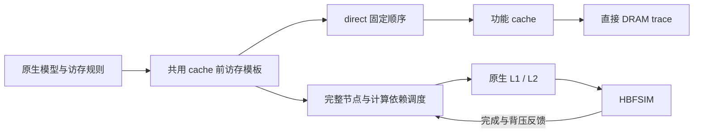

# 快速地址生成与精确 cosimulation 的衔接

原集成提交 `ad8afa309a1d95e420c09b71877e27858bf4c9f6` 共用了原生模型和地址规则，但 direct 的主要速度优势来自不运行计算调度、依赖等待和 HBFSIM。因而 direct 生成速度不能直接作为 cosimulation 加速比。

这次在同一独立分支 `codex/tilegen-trace-cosim-20260918-r1` 上继续收敛实现，让 **GEMV、SiLU 的 cache 前访存物化代码真正共用**。B8 仍暂停，写回仍逐请求 32 B，fill/RFO 仍为 128 B。

## 共用的位置

原生 Model / SourceBundle 提供源指令、lane、对象绑定和 range plan；新增每 call 的不可变 `PreparedMemory` 保存访存模板。direct 的 binding 和 fine cosimulation 的 Builder 都调用同一个 materializer，得到保留原 subop 分组、顺序、地址、宽度和 source ordinals 的访存描述。



- **GEMV**：lane／range 的静态形状只构建一次；每个 CTA 复制到目标容器并填入原地址公式的结果。保留逐 range 的服务地址映射校验。fine 的依赖边直接写入其最终所属节点，避免临时 vector 的再次分配、复制；边集合和次序不变。
- **SiLU**：从原模型公式编译每条指令的地址参数，保留端点、完整 grid 的对象边界和溢出检查。运行时做有检查的 CTA 地址平移，消除反复 JSON 查询。原公式对 lane 和 CTA 均为仿射关系；独立测试仍逐 lane 调用原公式核对。

共用的数据位于 cache 前，不包含 cache 命中、DRAM 请求顺序、请求时间或完成时间。direct 仍采用功能 cache；cosimulation 仍由原细粒度调度器推进依赖、计算、L1/L2、有限队列和 HBFSIM，保留 stall 与 overlap。**没有把 direct 的 cache 后 DRAM trace 用作精确 cosimulation 输入，也没有切换到 `cosim-fast`。**

为减少 fine 路径消费这些节点时的额外主机开销，还对 CTA 安装前的完整校验做了等价实现：每 CTA 预计算一次 warp token；依赖查重改用有界数组的逐节点标记，completion 与 issue 依赖仍共用查重域；名称查重引用现存字符串，避免复制。仍检查所有节点和边，接受／拒绝规则不变，未缓存或跳过动态模拟状态。

## 验证与性能口径

性能采用新旧可执行文件交替串行运行、同一冻结输入的完整子进程 CPU 时间；编译和输入准备另计。新增 `pipeline[].host_frontend_seconds` 只读取原 Builder 已有主机计时，独立于模拟结果。`retire_hash` 和 `retire_invariant` 包含于 `retire`；默认 resident 模式下这些数还包含在 engine 时间里，不能重复相加。

独立公式测试不以新版 fine Builder 作 oracle，避免两条路径共用错误却互相验证。精确 cosimulation 对照核对逐节点退休哈希、每 kernel 周期、事务、L2 事件顺序、overlap、scheduler 计数、dirty-sector 账本以及 HBFSIM 物理统计；有 trace 的对照还核对完整文件 SHA。

本次不改变既有精度资格：地址和计算仍是原生来源的结构模型，尚未证明所有隐式依赖完整，硬件时序尚未校准。验证范围为有界 B1 工作负载，不是全 1138-call 性能结论，也没有新增 NCU 拟合、GPU 采样或 XMU 部署。

## 实测结果

基准为原集成提交 `ad8afa3` 的冻结二进制 `ef7150b4…`；候选为 `build/shared-frontend-r2/tilegen_native`，SHA-256 `60c0d76d03fc61832a408ae0809ff139773d34a1aa4fe9407785d19df8787644`。同一 Apple arm64 主机、相同 C++20/O3/native/ThinLTO 构建参数；三组交替、串行运行。完整构建耗时 0.56 分钟，未计入运行时间。

工作负载是冻结 P32/D2 来源中的 **Decode2、layer 1、GEMV → SiLU → GEMV 子序列**，分别执行 512／1／512 CTA，共 9,733,656 个节点。它不是完整单 token decode；子序列从冷 cache 开始。

| 三次中位数 | 原集成版 | 本次衔接版 | 结论 |
|---|---:|---:|---|
| 完整子进程 CPU | 0.77 分钟（46.40 秒） | 0.77 分钟（45.97 秒） | 1.01×，减少约 0.9% |
| 完整子进程 elapsed | 0.78 分钟（46.61 秒） | 0.78 分钟（46.70 秒） | 无改善 |
| fine 引擎执行窗口，主机 wall time | 0.39 分钟（23.48 秒） | 0.36 分钟（21.79 秒） | 1.08×，耗时减少约 7.2% |

**完整 CPU 时间的波动范围重叠，不能宣称已经取得稳定的端到端加速。** 原版三次为 45.27–46.63 秒，新版为 45.90–46.44 秒。只做 shared materializer、尚未优化 CTA 校验的中间版本，三组中位数也只有 1.01×，同样不足以确认总体提速。保留这个中间结果是为了区分“共用生成代码”和“整体仿真明显更快”。

新版默认 fine 的 build 计时中位数约 0.91 秒，仅占引擎窗口约 4.2%；retire 约 1.99 秒，其中 hash 约 1.74 秒。其余执行窗口还包括图安装／回收、调度、cache 和 HBFSIM；目前没有分别测出这些项各自的耗时。当前短子序列还有约 23.5 秒的前置模型准备。继续大幅提速需要处理这些开销，单纯加快地址生成不够。以上均为宿主运行时间，模拟目标的周期没有缩短。

精确模型对照中，1,197,517 个模拟周期、75.60 MB DRAM read，以及 0.00 MB DRAM write（4,864 B，152 个 32 B 请求）全部保持一致。

## 回归证据

- 三组默认 `cosim`：所有逐节点退休哈希、每 kernel 周期、L2 有序事件、流量、overlap／scheduler 计数、dirty-sector 账本、HBFSIM 统计精确一致。
- 20 类 family 各 1 CTA：新版 `cosim --trace` 与旧版完整 trace 文件 SHA 相同；direct 同样逐字节相同。decode 子集的 direct trace 也逐字节相同。两种模式之间的文件仍不要求相等。
- 独立原公式 oracle：核对选中两次 GEMV 的 1,024 个 CTA、2,363,392 条访存描述与 mapper 调用顺序；SiLU 核对全部 96 个 call 的完整 grid 首尾 CTA，额外覆盖一个 Prefill 的全部 32 CTA，逐 lane 计算原公式。未用新版 fine 与新版 binding 互相充当独立 oracle。
- ASan/UBSan：CTA gate 的 2,330 个正负用例、11,530 项检查通过；dirty32 的 27,775 项检查、trace 的 18,981 项检查及功能 cache smoke 均通过。未运行 LeakSanitizer。
- 原近似 `cosim-fast` 的 decode 回归也通过，保留其原精度标记；它不是本次性能表的执行模式。

完整证据：[qualification JSON](../validation/shared-frontend.json)、[构建与源码 SHA](../validation/shared-frontend-build.json)、[原公式测试运行记录](../validation/shared-frontend-formula-receipt.json)。除六次配对 benchmark 外，功能回归可并发执行，其耗时不用于性能结论。

## 使用与复跑

`run.py` 默认使用本次构建；旧 `build/final` 二进制保留作基准。已有输出目录不会覆盖。

```sh
python3 run.py --input /absolute/path/workload.input --output build/new-cosim --mode cosim --trace
python3 run.py --input /absolute/path/workload.input --output build/new-direct --mode direct
python3 tests/run_frontend_benchmark.py --baseline build/final/tilegen_native --candidate build/shared-frontend-r2/tilegen_native --input ../validation-inputs/decode-512.input --output build/new-paired --repeats 3
python3 tests/run_unit_tests.py --output build/new-units --sanitize address,undefined
python3 tests/run_direct_projection.py --test prepared-memory --build build/shared-frontend-r2 --input ../validation-inputs/decode-512.input --output build/new-formulas
```
