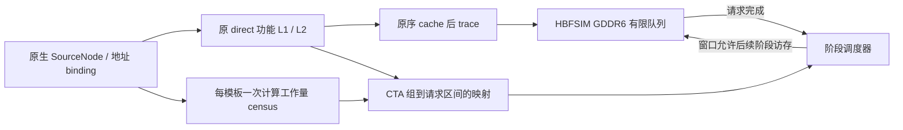
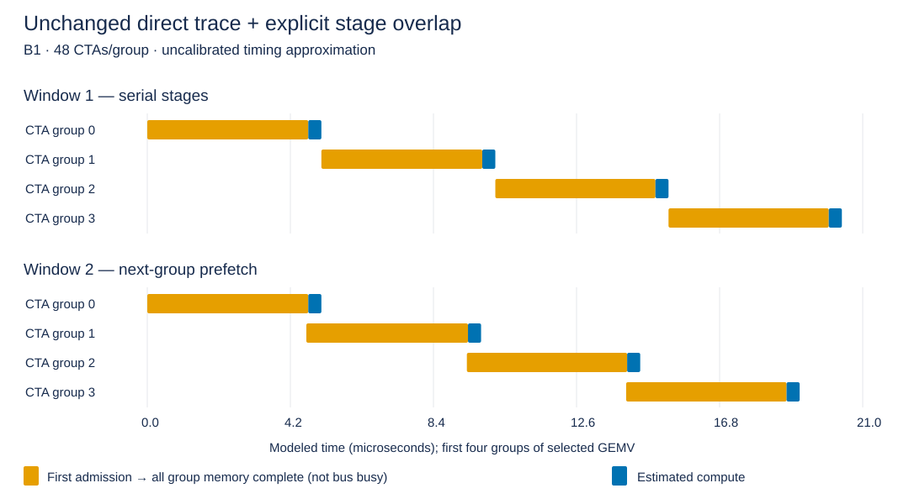

# Direct trace 上的阶段级 compute / memory overlap

本模式沿用原生 direct 的缓存后地址流，在独立 HBFSIM 回放器中加入显式计算延迟和阶段预取窗口。无需逐 warp 调度，也不把计算依赖图合并成更大的节点后再次执行。

分支仍为 `codex/tilegen-trace-cosim-20260918-r1`，B1，写回每请求 32 B，读填充/RFO 每请求 128 B。阶段模式是新增可选入口；原 direct、memory-only replay、精确 cosim 的默认语义保留。



## 实际运行规则

`--phase-ctas 48` 将每个 kernel 的连续 CTA 划成至多 48 CTA 的组，末组可以较小。这里的“阶段”是模型定义的 CTA 组，**不是从指令中识别出的真实 load / compute / store 三段**。

阶段打开后，按原 trace 顺序向 HBFSIM 提交其 fill、RFO 和 dirty writeback。该阶段的全部请求完成后，阶段计算就绪。计算依 stage 顺序在一条逻辑计算时间线上执行；下一组访存可以同时在 HBFSIM 中运行。

- `--prefetch-stages 1`：一个阶段访存、计算全部完成后才打开下一阶段，作为串行基线。
- `--prefetch-stages 2`：最多两个尚未计算完成的阶段，允许下一组访存和当前计算重叠；也允许两组访存同时在有限队列内竞争。
- `4`、`8`：增大模型预取窗口，只表达更强的假设，不自动代表真实 GPU 的并发度。
- kernel 边界须等上一 kernel 全部访存和计算完成。后端行缓冲状态保留，不重建 GDDR6 设备。
- 零 DRAM 阶段仍保留计算；最后一个阶段的计算尾部计入总时间。

调度器按事件推进；若后端仍有请求未得到可知完成时间，逐周期推进。已知完成事件时，跳到最近的内存完成或计算结束，不能跨过更早的计算事件。

## 计算时间从哪里来

没有用完整 cosim 的耗时反推，也没有拟合 NCU。每个 call/template_class 只扫描一次原生 `SourceNode`；依据当前参考 profile 的 SIMD、SFU、SHFL、Tensor 吞吐和尾延迟计算资源需求。

标量管线 reservation 为 `ceil(elements / throughput) × ceil(throughput / width)`；Tensor 为 `ceil(declared_FMA / tensor_width)`。按 `warp % 4` 分配到参考 SM 的四个 subpartition；每个资源的 reservation 相加，再加一次最大尾延迟，CTA 估计取资源最大值。按 `cta % 48` 放置到参考 48 SM，同一 SM 的 CTA 估计相加，再取 SM 最大值作为阶段计算周期。

这是一套公开、可复查的资源需求近似，不是依赖路径执行时间。尤其：一个 SiLU CTA 只使用其所分配的 SM，不能把它的工作量直接除以 48。

输出保留每模板、每 subpartition、每管线的节点数、工作量、reservation、尾延迟、实际 CTA 数及每阶段 SM 工作账。`modeled_scalar_elements` 是有效 lane 工作槽，包括控制、地址及 MOV 等指令，**不是 FLOPs**。

## 精度边界

| 项目 | 本模式 |
|---|---|
| DRAM 地址、方向、大小、顺序 | 原 direct trace 原样回放；整文件 SHA 和请求 FNV 校验 |
| DRAM bank/row/channel、排队、有限 credit | 继续由原 HBFSIM GDDR6 后端执行 |
| L1/L2 命中和 dirty sector | 固定为 direct 时得到的结果，不受新的阶段时序反馈影响 |
| cache hit 的延迟 | 尚未加入；无 DRAM 不等于真实硬件零访存延迟 |
| 计算与内存重叠 | 跨 CTA 组显式建模；组内统一“访存完成 → 计算” |
| warp issue、数据依赖、shared、barrier 等待 | 未动态执行；计算估计也不包含这些等待 |
| writeback 依赖 | 随触发 eviction 的 CTA 组计费，不将 writeback 当作该组计算产生的输出写 |
| 硬件时序资格 | 未校准；不宣称完整 inference latency 或 NCU 精度 |

窗口变化同时改变访存并发度与重叠，窗口 1/2 的差不能全部归因于 compute overlap。输出的 `compute_native_outstanding_overlap_cycles` 仅表示“计算活跃且有未完成 native 请求”的时间，**不是 DRAM 数据总线忙碌时间**。

阶段总 makespan 包含最后的计算尾部；HBFSIM physical span 只反映实际内存活动范围。两种带宽分母分开报告，不能用更小的内存窗口带宽冒充整个阶段流程的有效带宽。

当前自动导出支持九个已有免逐 CTA DAG 的 binding family：PlainNorm、P28QKV、Rotary、GEMMO、FusedNorm、GEMMGate、SiLU、GEMMDown、GEMV。其余 helper、attention、IndexPut、PrefillCopy 明确拒绝自动阶段 profile；原 direct 仍可执行它们。**本次不是完整 1138-call inference 的阶段时序覆盖，也没有恢复 B8 合并。**

## 使用

```sh
python3 build.py --output build/stage-native-r1 --jobs 2 --native --thin-lto
python3 build.py --replay --output build/stage-replay-r1 --jobs 2 --native --thin-lto

python3 run.py --binary build/stage-native-r1/tilegen_native \
  --input /absolute/path/workload.input --mode direct --phase-ctas 48 \
  --output build/direct-with-stages

python3 replay.py --binary build/stage-replay-r1/tilegen_replay \
  --input /absolute/path/workload.input --source-run build/direct-with-stages \
  --mode stage-overlap --prefetch-stages 2 --output build/stage-window2
```

同一份 trace/profile 可以重复比较窗口 1、2、4、8，无需重新生成地址或 cache。CPU 分钟和 elapsed 分开记录；直接生成、编译与输入准备不计入回放时间。没有 phase profile 的旧 trace 不能凭空恢复 cache hit 或计算阶段，入口会拒绝。

## 验证结果

完整数据、收据与 SHA 见 [validation/stage-overlap.json](../validation/stage-overlap.json)。本次 CPU 数据各配置一次实测，不能把小幅差异解读为统计显著提速。

Decode 样本为 Llama3-8B B1 的 `epoch-3-launch-28/29/30`：GEMV 512 CTA、SiLU 1 CTA、GEMV 512 CTA，合计 23 阶段。**只是选定子集，不是完整层、完整 decode 或完整 P32/D2。**

| 路径 | 本机 CPU 分钟 | 模拟时间 μs | 时间范围 |
|---|---:|---:|---|
| direct + 阶段信息生成 | 0.402882 | — | 原地址/cache/trace 生成；无时序执行 |
| 纯访存 replay | 0.022181 | 225.05 | native 内存跨度；无计算和 kernel 屏障 |
| 阶段 W1 | 0.022262 | 244.27 | 包含计算尾部的阶段总 makespan |
| 阶段 W2 | 0.021956 | 227.88 | 同上，允许下一阶段预取 |
| 阶段 W4 | 0.022009 | 227.88 | 此样本未进一步减少 makespan |

**生成 + W2 回放合计 0.424838 CPU 分钟（25.49 秒）。** 已生成 trace 后，每次窗口分析约 0.022 CPU 分钟，无须重复原生地址展开。

W1 → W2 的阶段总时间降低 6.71%；计算需求始终为 41,781 周期，compute/native-outstanding 重叠代理从 0 增至 35,570 周期。W2 的整个阶段流程有效带宽为 **331.89 GB/s**；按 native 内存跨度计算为 **333.65 GB/s**，两者分母不同。



图由本次实际模拟事件生成。橙色为某组第一条准入至全部内存请求完成的跨度，可能包含等待；蓝色为计算估计。没有把橙色当成 DRAM 总线忙碌时间。

历史同输入 fine cosim 的三次 CPU 中位数为 **0.766127 分钟**。它相对于本次阶段回放的主机开销约为 34.89 倍；计入 direct 生成后约为 1.80 倍。**这些是不同精度模式的主机成本对照，不是等价模拟的加速比**：fine 时序为 533.81 μs，写流量 4,864 B；direct/stage 写流量 33,920 B。fine 数据没有参与新模式计算成本的拟合，不能把阶段时间更短解释为更准确。

独立的九类 binding 测试每类选 1 CTA。增加 profile 前后 trace SHA 相同；W1/W2 都为 823.61 μs，重叠为 0，因为每个 kernel 只有一个阶段且保留 kernel 屏障。带 profile 生成 CPU 为 0.788615 分钟，W2 回放为 0.005605 分钟。这也说明当前主要主机成本仍在前端准备/地址/cache 生成，阶段回放不会自动加速该部分。

验收覆盖：

- Decode 的 591,652 条请求、75,595,776 B 读、33,920 B 写及完整 trace SHA 与旧 direct 完全一致；九类 binding 开关 profile 的 SHA 也完全一致。
- 原 memory-only replay 的物理统计、周期、逐 call 结果和请求 hash 精确回归。
- 七组单元测试普通构建与 ASan/UBSan 均通过；新阶段调度 4,428 项检查，独立手算计算资源 25 项检查。LeakSanitizer 未运行。
- 阶段 CLI 14 例、旧 replay CLI 17 例通过；覆盖 profile 篡改/类型错误、范围、预算、完整发布与来源 SHA 绑定。
- helper 等未覆盖 family 显式拒绝，不发布成功 trace。完整 1138-call、B8、NCU 校准仍不在本次验收范围内。
